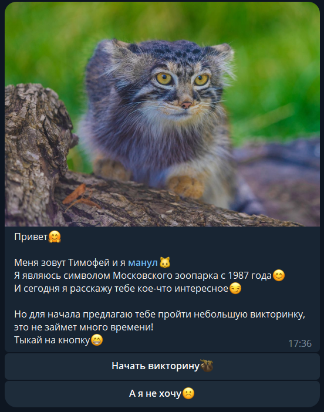
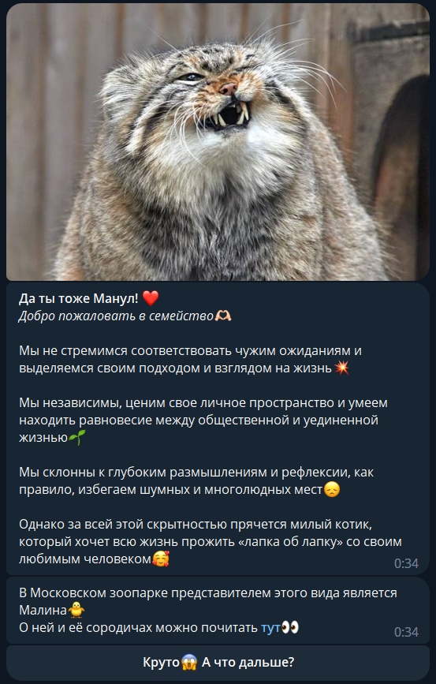
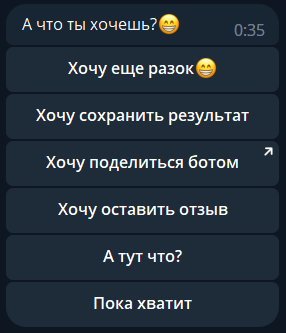
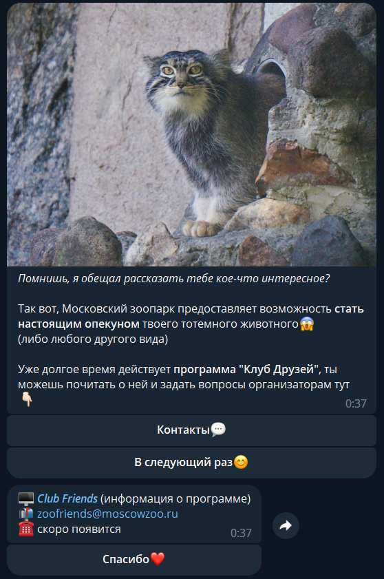
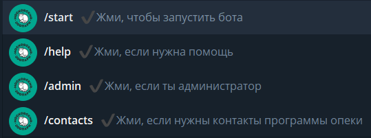
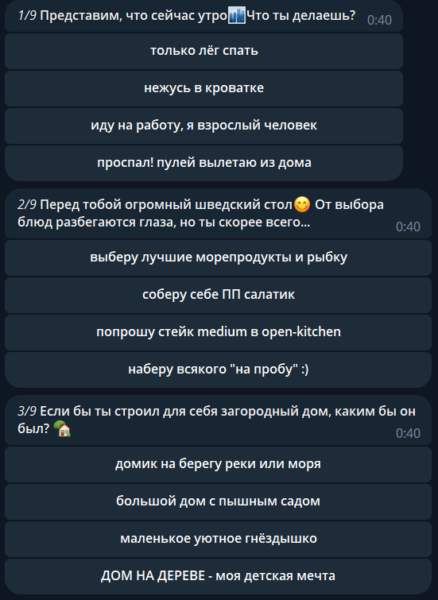
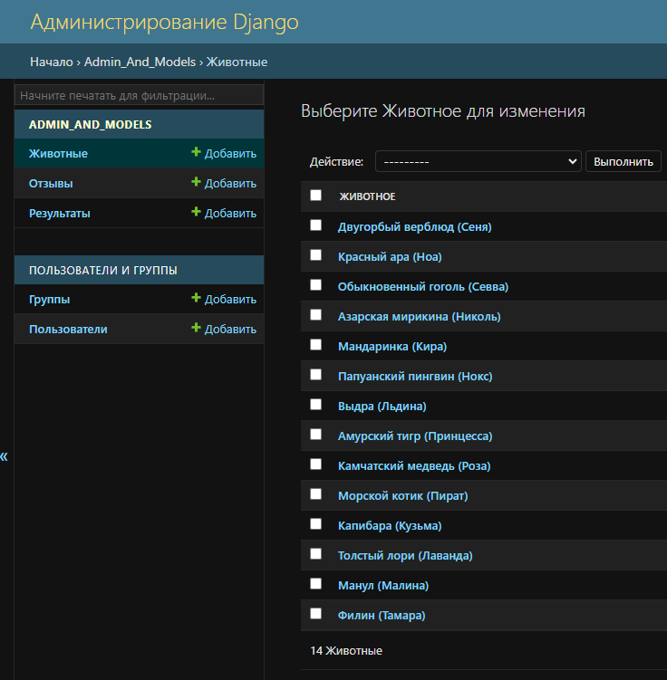
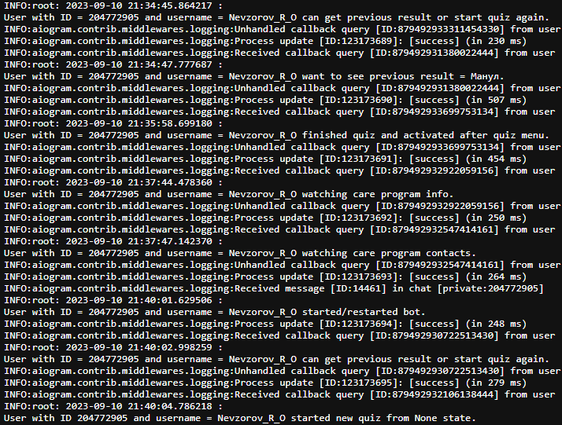

## Развлекательный Telegram-бот Московского Зоопарка - узнай своё тотемное животное!

---

Проект команды
[Невзорова Романа](https://github.com/n0fl3x),
[Дормостук Ксении](https://github.com/equestriann)
и [Кузнецовой Дарьи](https://github.com/dasha532)
для [Московского Зоопарка](https://moscowzoo.ru/)
при содействии онлайн-школы программирования [SkillFactory](https://skillfactory.ru/).

Данный проект является развлекательным Telegram-ботом с викториной
для определения Вашего тотемного животного, а также для привлечения внимания
и пожертвований к программе опеки над редкими животными Московского Зоопарка.

Бот развёрнут с помощью облачной платформы [PythonAnywhere](https://www.pythonanywhere.com/)
и доступен в Telegram по ссылке [Спроси Тимофея](https://t.me/Moscow_Zoo_bot).

---

Данный бот представляет собой имитацию переписки с маскотом Московского Зоопарка - манулом по имени Тимофей.

Интерфейс и сообщения выполнены в дружелюбном стиле и содержат ссылки на информационные страницы
о различных животных зоопарка.

Помимо прочего бот предоставляет пользователю дополнительные возможности взаимодействия с собой.

В том числе информацию о программе опеки над животными с необходимыми контактами.

Несмотря на то, что бот выполнен в стиле "бесконечной" переписки, для удобства навигации имеется меню с командами.

Сама викторина выполнена в виде последовательных вопросов, которые в конце определяют результат пользователя
на основе данных им ответов. Для определения итогового результата используется система "взвешенных" ответов
и изменяющихся коэффициентов.

---

Данный проект реализован, в том числе, с применением библиотеки aiogram, а также фреймворка Django.

Библиотека aiogram позволяет боту работать в асинхронном режиме, а, значит, уверенно справляться нагрузками.
Также она предоставляет множество готовых удобных решений для различных задач, таких как, к примеру,
работу с HTML-тегами и т.н. машину конечных состояний (FSM - Finite State Machine).

Фреймворк Django, в данном случае, был использован в качестве готового решения для реализации
функционала веб-панели администратора, для возможности редактирования базы данных с
потенциальными тотемными животными, а также просмотра статистики результатов и изучения отзывов пользователей бота.

В качестве базы данных используется стандартная для фреймфорка Django - sqlite3.
В данном проекте этого вполне достаточно.

Помимо прочего, в боте полностью настроено логгирование всех уровней для
получения отладочной информации при необходимости.

